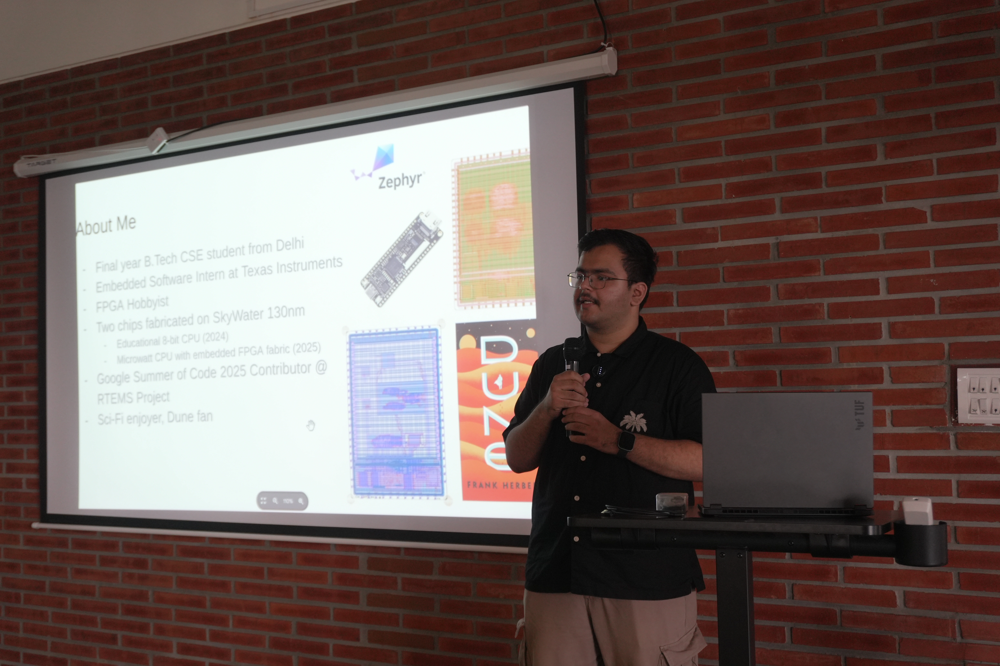
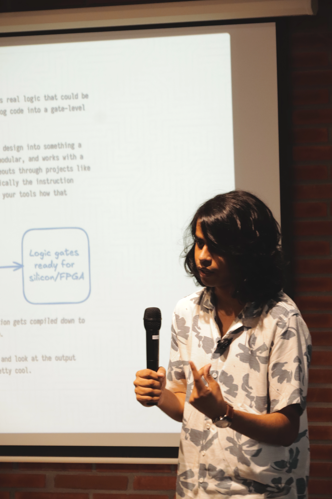
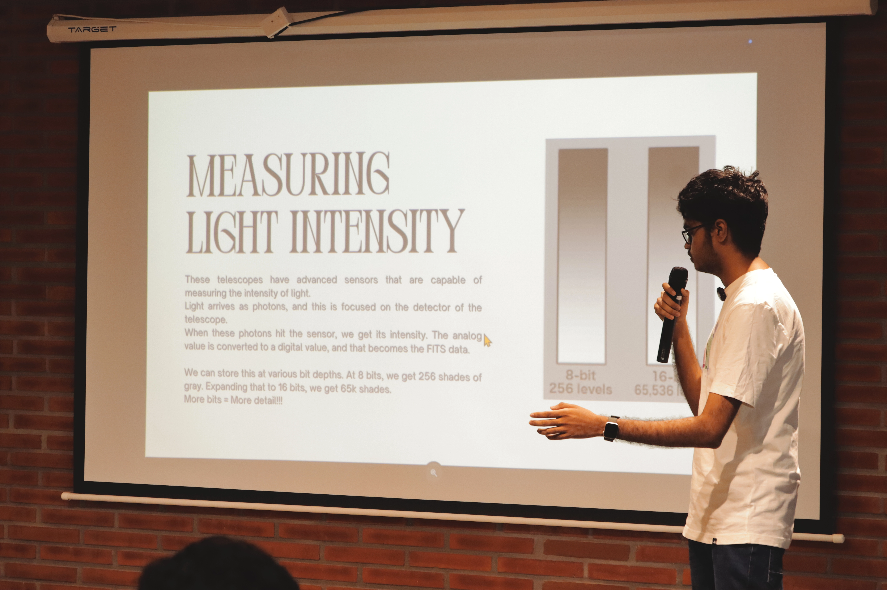
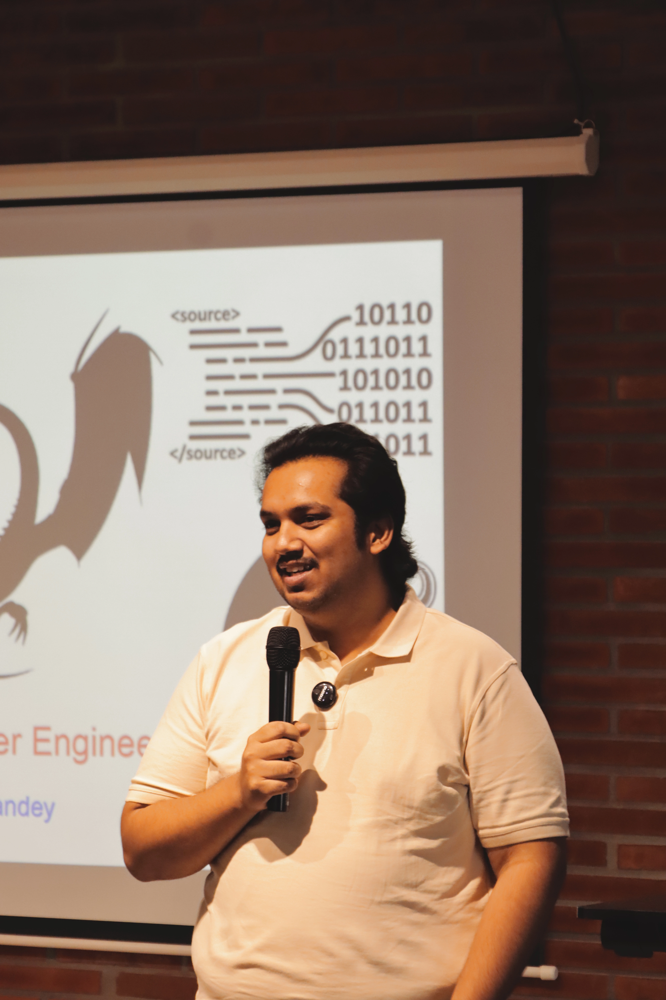

# Foss Talk 3.0
FOSS Talks 3.0 is a curated event series where developers share deep dives into their projects, technical learnings, and experiences building in the FOSS ecosystem.

Venue: [Samagata Space](https://maps.app.goo.gl/RG6rWAuzp9P9bzty8), Church Street, Bengaluru
Timing: 10:00 to 14:00
Date: 11th April 2026

## Topics

### Building an FPGA RISC-V Soft Core
**Sameer Srivastava**

Sameer takes a deep dive into RISC-V and the process of building a RISC-V SoC on an FPGA. The talk explores the fundamentals of implementing a processor on FPGA hardware, along with the minimal C library used to interact with GPIOs, UART, and onboard LEDs. He also discusses his ongoing work and the challenges involved in developing a custom RISC-V system.

---

### You Don't Need Expensive Tools to Play with Silicon
**Pranav M**

Pranav explores how you can get started with RISC-V and digital hardware without relying on expensive proprietary tools. He walks through an open hardware development stack using Verilator and Icarus for simulation, Yosys for synthesis, and OpenROAD for place-and-route. The talk also introduces platforms such as Tiny Tapeout, demonstrating how open-source tooling is making real silicon increasingly accessible to students and hobbyists.

---

### Photographer's Guide to the Galaxy
**Anshul P**

Anshul introduces SIRIL, a free and open-source software for processing astrophotography images. The talk explores how SIRIL can be used to process and enhance images captured of objects in the night sky, while covering some of its key features and workflows. The session provides an introduction to astrophotography processing for both beginners and experienced photographers.

---

### The Tao of Compiler Engineering
**Ashutosh Pandey**

Compiler engineering sits at a unique intersection of hardware, computer science theory, and real-world engineering trade-offs. In this session, Ashutosh explores the two fundamental goals of a compiler: compiling code correctly and generating efficient machine code. Drawing from his experience at Arduino, FSF/GNU, Intel Mobileye, and AMD, he discusses the work of compiler engineers, the challenges involved in building compilers, and the often surprising ways compiler technology impacts modern computing.

